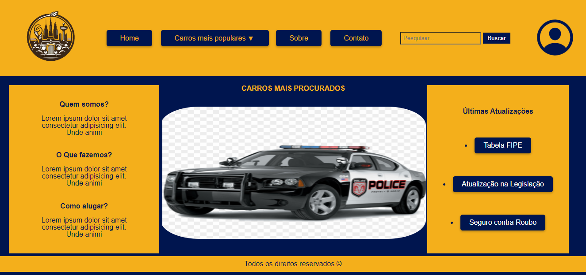

<h1 align="center"> Projeto Final de Semestre - Front-end </h1>

Um site simples apenas usando mecanicas de HTML5 e CSS3.

  <a href="#-tecnologias">Tecnologias</a>&nbsp;&nbsp;&nbsp;|&nbsp;&nbsp;&nbsp;
  <a href="#-projeto">Projeto</a>&nbsp;&nbsp;&nbsp;|&nbsp;&nbsp;&nbsp;
  <a href="#memo-licença">Licença</a>

 

## 🚀 Tecnologias

Esse projeto foi desenvolvido com as seguintes tecnologias:

- HTML e CSS
- Git e Github

## 💻 Projeto

Duarante essa cadeira aprendemos a estruturar um HTML e CSS. Decidimos então criar um site de aluguel para carros;
[LINK PARA O PROJETO](https://bugred.github.io/front-end-html-css/)

## :memo: Licença

Esse projeto está sob a licença MIT.

---

Feito com ♥ by Yahto Dev :maple_leaf:
